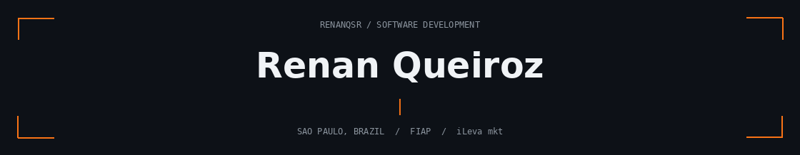
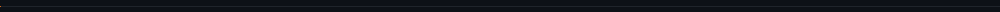

  

  
  

### A little about me

**Web Development Intern at iLeva mkt · Software Engineering student at FIAP · SENAI graduate**

I work on portals, dashboards and operational tools used in production. I connect **frontend interfaces, backend rules, SQL and APIs**, with a practical focus on diagnosing problems and turning operational needs into working software.

I'm interested in **AI-powered applications** and the engineering behind reliable systems.

### What I've delivered

- **4 dashboards:** built two from scratch and expanded two existing ones, connecting data sources and adding analytical views.
- **Operational tools:** developed customer support and catalog management panels, including real-time messaging with WebSocket.
- **Production improvements:** investigated bugs, SQL inconsistencies and performance bottlenecks; implemented targeted security fixes.

<strong>More about analytics, performance & reliability</strong>

 

**Analytics** — GA4/GTM integrations, standardized interaction tracking and visual heatmaps.

**Performance** — frontend request queues, PHP session contention and SQL Server investigation using profiling and actual execution plans.

**Business rules** — scoring diagnostics and controlled historical data reconciliation.

**Security** — targeted authentication, session, input handling and concurrency fixes, validated against existing workflows.

### Technologies & tools

  

  
  
  
  
  
  

### Selected projects

<table>
<tr>
<td width="50%" valign="top">

<h3>MobiliAI</h3>

<strong>AI-assisted furniture platform</strong>

SENAI team graduation project combining furniture visualization with administrative tools.

<strong>My work:</strong> admin dashboard, access profiles, coupon assignment, contribution to Replicate API integration, presentation page and brand identity.

<code>Next.js</code> <code>TypeScript</code> <code>APIs</code>

<a href="https://github.com/Guimenn/MobiliAI"><strong>Explore the code →</strong></a>

</td>
<td width="50%" valign="top">

<h3>Personal portfolio</h3>

<strong>Experience, projects & background</strong>

My personal website bringing together my development experience and projects, with Portuguese and English versions.

<strong>My work:</strong> development of the website with Next.js and TypeScript.

<code>Next.js</code> <code>TypeScript</code>

<a href="https://renanqueiroz.vercel.app/"><strong>Visit the website →</strong></a>

</td>
</tr>
</table>

  <strong>Open to junior developer roles & development internships</strong> 
  São Paulo & ABC region · On-site, hybrid or remote  
  <a href="https://renanqueiroz.vercel.app/">Portfolio</a> · <a href="https://www.linkedin.com/in/renanqsr">LinkedIn</a>

